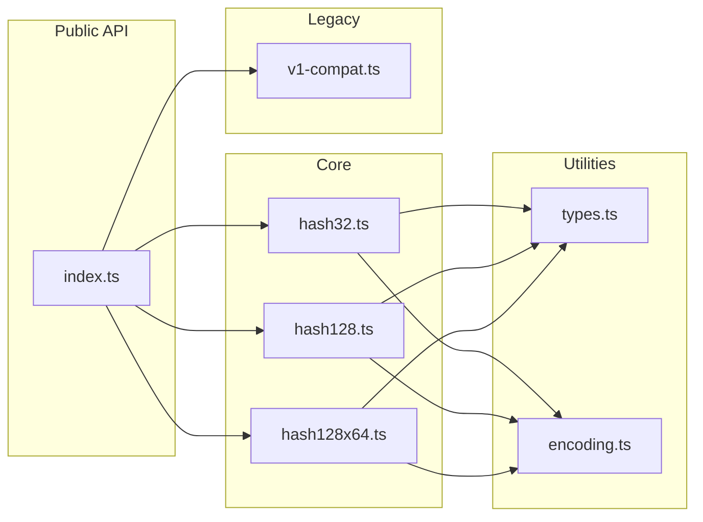

# MurmurHash3 in JavaScript: A Practical Implementation Guide

## Introduction

MurmurHash3 is a non-cryptographic hash function designed for fast hashing of general-purpose data. It's widely used in hash tables, bloom filters, and data partitioning where collision resistance matters more than cryptographic security.

Most JavaScript implementations only provide 32-bit output. This limits their usefulness for applications requiring lower collision probability or larger hash spaces. This implementation provides both 32-bit and 128-bit variants, filling a gap in the JavaScript ecosystem.

## The Problem

When you need to hash data in JavaScript, you typically reach for one of the popular MurmurHash packages. However:

- **murmurhash-js** (2.3M weekly downloads): 32-bit only
- **murmurhash** (757K weekly downloads): 32-bit only
- **imurmurhash** (33M weekly downloads): 32-bit only, incremental

If your application requires 128-bit hashes—for example, generating UUIDs, reducing collision probability in large datasets, or implementing certain distributed algorithms—you're left without options.

## Architecture Overview

The implementation consists of three hash algorithms sharing common infrastructure:

```mermaid
graph TD
    A[Input: string | Uint8Array] --> B[toBytes encoding]
    B --> C{Hash Function}
    C --> D[hash32]
    C --> E[hash128 x86]
    C --> F[hash128x64]
    D --> G[32-bit unsigned int]
    E --> H[128-bit hex/BigInt]
    F --> H

    style A fill:#e1f5fe
    style G fill:#c8e6c9
    style H fill:#c8e6c9
```

### Module Structure



## Implementation Details

### Input Handling

All inputs are normalized to `Uint8Array` before processing:

```typescript
const encoder = new TextEncoder();

export function toBytes(input: HashInput): Uint8Array {
  if (input instanceof Uint8Array) {
    return input;
  }
  return encoder.encode(input);
}
```

This approach keeps the core hash functions simple while supporting both string and binary inputs.

### 32-bit Hash (x86)

The simplest variant processes data in 4-byte blocks:

```typescript
import { hash32 } from 'murmur-hash';

hash32('hello');                    // 613153351
hash32('hello', 42);                // with seed
hash32(new Uint8Array([1,2,3]));    // binary input
```

The algorithm:
1. Process input in 4-byte blocks
2. Apply mixing constants (C1, C2)
3. Rotate and mix with running hash
4. Process remaining bytes
5. Apply final mix function

### 128-bit Hash (x86)

The x86 128-bit variant uses four 32-bit hash values processed in parallel:

```typescript
import { hash128 } from 'murmur-hash';

hash128('hello');                          // '2360ae465e6336c6ad45b3f4ad45b3f4'
hash128('hello', { seed: 42 });            // with seed
hash128('hello', { output: 'bigint' });    // as BigInt
```

This variant processes 16 bytes per block, updating four hash values (h1, h2, h3, h4) with different rotation amounts and mixing constants.

### 128-bit Hash (x64)

The x64 variant uses native 64-bit operations for better performance on 64-bit systems. Since JavaScript lacks native 64-bit integers, this implementation emulates them using pairs of 32-bit numbers:

```typescript
import { hash128x64 } from 'murmur-hash';

hash128x64('hello');                          // 'cbd8a7b341bd9b025b1e906a48ae1d19'
hash128x64('hello', { seed: 42 });            // with seed
hash128x64('hello', { output: 'bigint' });    // as BigInt
```

The 64-bit emulation includes:
- `add64()`: Addition with carry propagation
- `multiply64()`: Full 64-bit multiplication
- `rotl64()`: Rotation across 32-bit boundary
- `xor64()`: Bitwise XOR

### Streaming API

For processing large data or unknown-length streams:

```typescript
import { createHash32, createHash128, createHash128x64 } from 'murmur-hash';

const hasher = createHash32();
hasher.update('hello');
hasher.update(' world');
hasher.digest();  // same as hash32('hello world')
```

Note: Data is buffered until `digest()` is called, not processed incrementally. This simplifies the implementation while still allowing chunked input.

## Key Design Decisions

### 1. BigInt Output Option

128-bit hashes are traditionally returned as hex strings. However, if you need to perform arithmetic or comparisons, BigInt is more convenient:

```typescript
const h1 = hash128('key1', { output: 'bigint' });
const h2 = hash128('key2', { output: 'bigint' });

if (h1 < h2) {
  // numeric comparison works
}
```

### 2. Dual Build Format

The package ships both ESM and CJS:

```javascript
// ESM
import { hash32 } from 'murmur-hash';

// CJS
const { hash32 } = require('murmur-hash');
```

This is achieved through tsup with dual entry points in package.json.

### 3. Zero Dependencies

The entire implementation uses only built-in APIs (TextEncoder, Uint8Array, BigInt). This eliminates supply chain concerns and keeps bundle size minimal.

### 4. TypeScript Throughout

Full type definitions are included, providing autocomplete and compile-time checks:

```typescript
import type { HashInput, Hash128Options } from 'murmur-hash';

function hashWithDefaults(input: HashInput, options?: Hash128Options) {
  return hash128(input, { seed: 0, output: 'hex', ...options });
}
```

## Performance Characteristics

Benchmarks on Apple M1:

| Function | Input | Ops/sec |
|----------|-------|---------|
| hash32 | short string | 2,000,000+ |
| hash32 | 1KB bytes | 560,000 |
| hash128 | short string | 540,000 |
| hash128 | 1KB bytes | 350,000 |
| hash128x64 | short string | 530,000 |
| hash128x64 | 1KB bytes | 35,000 |

The x64 variant is slower due to 64-bit emulation overhead. If you don't specifically need x64 compatibility, use the x86 128-bit variant.

## Real-World Applications

### Bloom Filters

128-bit hashes provide enough bits to derive multiple hash values for a bloom filter:

```typescript
function bloomHashes(key: string, k: number): number[] {
  const h = hash128(key, { output: 'bigint' });
  const h1 = Number(h >> 64n);
  const h2 = Number(h & ((1n << 64n) - 1n));

  return Array.from({ length: k }, (_, i) =>
    Math.abs((h1 + i * h2) % filterSize)
  );
}
```

### Consistent Hashing

Partition data across nodes using hash ring:

```typescript
function getNode(key: string, nodes: string[]): string {
  const keyHash = hash32(key);
  const nodeHashes = nodes.map(n => ({ node: n, hash: hash32(n) }));
  nodeHashes.sort((a, b) => a.hash - b.hash);

  for (const { node, hash } of nodeHashes) {
    if (hash >= keyHash) return node;
  }
  return nodeHashes[0].node;
}
```

### Content-Addressable Storage

Generate deterministic identifiers for content:

```typescript
function contentId(data: Uint8Array): string {
  return hash128x64(data);  // 128-bit hex string
}
```

### Data Deduplication

Fast comparison for duplicate detection:

```typescript
const seen = new Set<string>();

function isDuplicate(data: string): boolean {
  const hash = hash128(data);
  if (seen.has(hash)) return true;
  seen.add(hash);
  return false;
}
```

## When to Use This

**Use MurmurHash3 when you need:**
- Fast hashing for hash tables or caches
- Consistent hashing for distributed systems
- Bloom filter hash functions
- Data fingerprinting or deduplication
- Content-addressable storage identifiers

**Do not use MurmurHash3 for:**
- Passwords (use bcrypt, scrypt, or Argon2)
- Security tokens (use cryptographic hashes)
- Digital signatures
- Any security-sensitive application

MurmurHash is designed for speed and distribution quality, not cryptographic security. An attacker with knowledge of your hash function can trivially generate collisions.

## Conclusion

This implementation fills a gap in the JavaScript MurmurHash ecosystem by providing 128-bit output options. The x86 128-bit variant offers a good balance of speed and collision resistance for most applications. The x64 variant is available for compatibility with systems that use that algorithm.

Key takeaways:
- Use `hash32` for speed-critical applications with smaller datasets
- Use `hash128` for lower collision probability or bloom filters
- Use `hash128x64` only when you need x64 algorithm compatibility
- Never use for security-sensitive applications

The package is available on npm as `murmur-hash` and supports both ESM and CommonJS imports.
